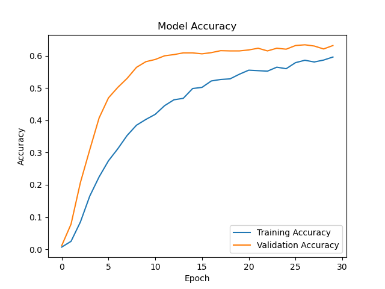

# Coin Image Classification

An AI model that classifies different types of coins.

## Description

This project uses a Convolutional Neural Network (CNN) to classify images of various coins. The model is trained on a couple datasets from Kaggle containing images of different coins from around the world.

The current model was trained on a dataset consisting of a mixture of:
- [World coins](https://www.kaggle.com/datasets/wanderdust/coin-images)
- [Roman Republican coins](https://www.kaggle.com/datasets/mexwell/coin-image-dataset/data)

## Prerequisites

- Python 3.x
- Conda (recommended for TensorFlow installation)
- Required packages:

  - Tensorflow
  - Scikit-learn
  - Pandas
  - Numpy<2
  - Pillow
  - Keras
  - Opencv-python
  - Colorama
  - Matplotlib

## How to run

1. Clone this project

2. Install the requirements.txt

3. Create the dataset by running the install.sh bash script. It will install and format the datasets for you.

4. Running the model:
   - Execute `main.py`
   - Choose train and wait till the process is finished

## Model Architecture

This classification model was built using a Convolutional Neural Network (CNN). It's trained on 30 epochs as that was found to be the optimal amount. Occasionally when training the model, it may stop before reaching 30 epochs. This is because the model couldn't progress anymore.

## Model Results

## Contributors
[WarningImHack3r](https://github.com/WarningImHack3r) - For his consistant help with faster training and testing.